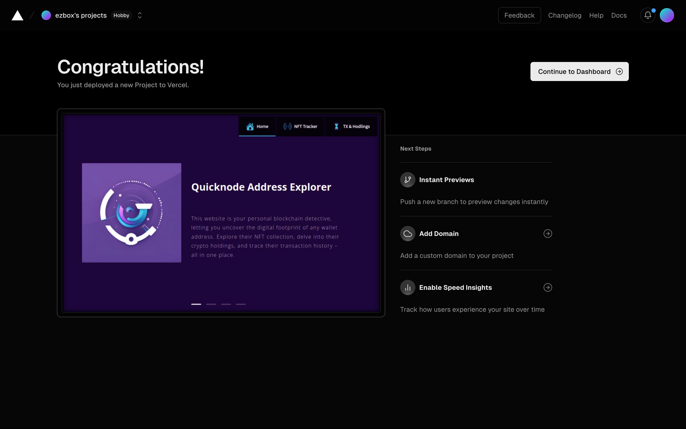

<div align="center">
    
    <h1>Quicknode Address Explorer</h1>
    <p>
    Your personal blockchain detective, letting you uncover the digital footprint of any wallet address.
    <br>
    Explore their NFT collection, delve into their crypto holdings, and trace their transaction history – all in one place.
    </p>
</div>

### Table of Contents

- [Getting Started](#getting-started)
- [Technologies Used](#technologies-used)
- [Live Version](#live-version)

## Getting Started

First, run the development server:

```bash
npm run dev
# or
yarn dev
# or
pnpm dev
# or
bun dev
```

Open [http://localhost:3000](http://localhost:3000) with your browser to see the result.

You can start editing the page by modifying `app/page.tsx`. The page auto-updates as you edit the file.

This project uses [`next/font`](https://nextjs.org/docs/basic-features/font-optimization) to automatically optimize and load Inter, a custom Google Font.

## Technologies Used

<div align="left">
    
    
     
    
</div>

## Live Version

<div align="center">
    
    <h3>
        <a href="https://quicknode-address-explorer.vercel.app/" target="_blank">
            Live App
        </a>
    </h3>
</div>
